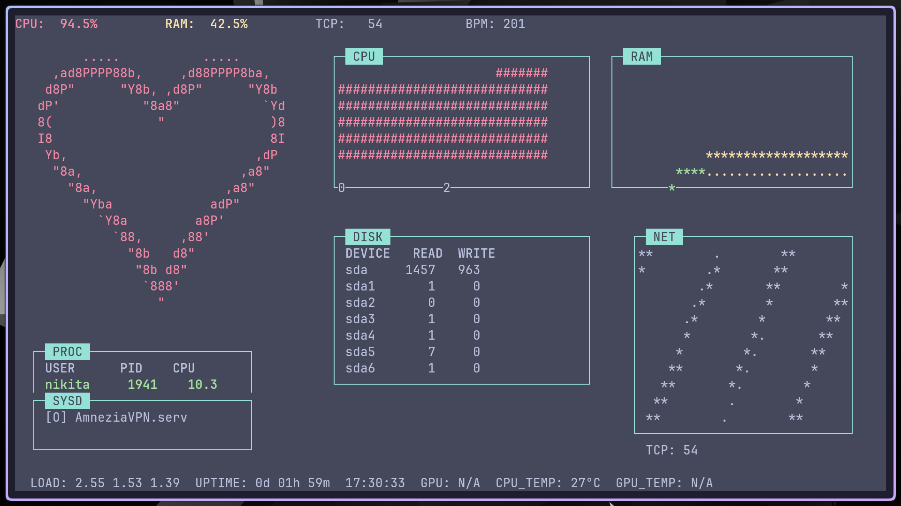
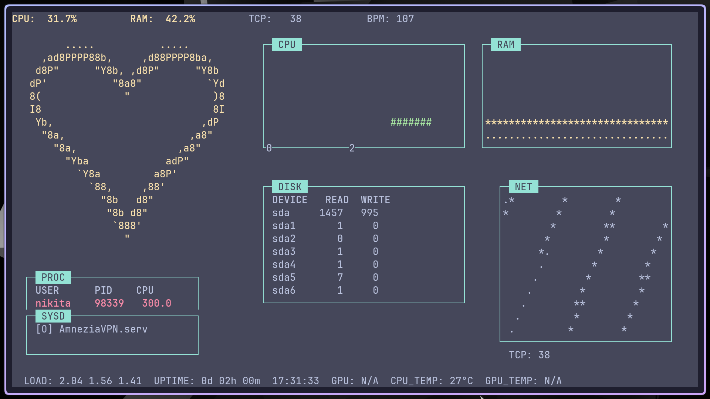
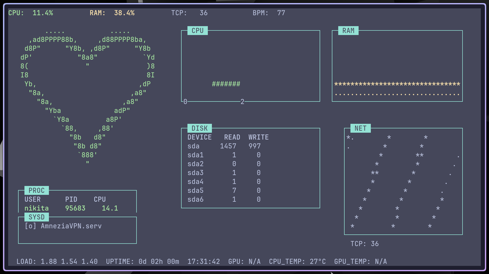

# System Visualizer

**Terminal-based system monitor with a beating ASCII heart**

---

## 🖼️ Screenshots

| Низкая нагрузка (зелёное) | Средняя нагрузка (жёлтое) | Высокая нагрузка (красное) |
|:---:|:---:|:---:|
|  |  |  |

*Сердце меняет цвет и частоту пульса в зависимости от загрузки CPU.*

---

## ✨ Features

- ❤️ **Beating ASCII heart** – colour and pulse rate reflect CPU load
- 📊 **Real-time CPU histogram** – per‑core usage with coloured bars
- 📈 **Memory usage graph** – smoothed line with history
- 📋 **Top processes** – sorted by CPU usage, colour‑coded
- 💾 **Disk I/O** – read/write speeds in KB
- 🌐 **Network connections** – TCP socket count visualized as stars
- 🧩 **systemd units** – active services with dancing animation
- 🎨 **Adaptive layout** – works in any terminal ≥ 80×24
- 🚀 **Lightweight** – single C++ file, no external dependencies except ncurses

---

## 🛠️ Installation

### Prerequisites
- **C++ compiler** (g++ ≥ 9 or clang ≥ 12)
- **ncurses** development library

**Ubuntu/Debian:**
sudo apt update
sudo apt install g++ libncurses-dev make

**Fedora:**
sudo dnf install gcc-c++ ncurses-devel make

Arch Linux:

sudo pacman -S gcc ncurses make

Build from source

git clone https://github.com/your-username/system_vis.git
cd system_vis
make

The executable system_vis will be created in the project root.
Run

./system_vis

Press q to quit.
🧩 Usage

Once running, the interface is divided into logical sections:

    Left column: beating heart (top) + process list (bottom)

    Right column: CPU graph (top‑left), RAM graph (top‑right), disk I/O (middle), network (bottom)

    Bottom bar: system load, uptime, GPU info (if available), temperatures

All values update every 70ms, giving smooth real‑time feedback.
📂 Project Structure

system_vis/
├── docs/
│   ├── screenshot1.png      # low load
│   ├── screenshot2.png      # medium load
│   └── screenshot3.png      # high load
├── src/
│   └── main.cpp       # single-file implementation
├── LICENSE                  # MIT License
├── .gitignore               # ignore build artefacts
└── README.md                # this file

🔧 Customization

You can tweak the behaviour by editing constants in system_vis.cpp:

    RingBuffer::max_size – history length for RAM graph (default 60)

    Smoother::alpha – smoothing factor (default 0.3)

    period calculation – adjust pulse sensitivity to CPU load

After modifications, recompile with make clean && make.
🤝 Contributing

Contributions are welcome! If you have a feature request, bug report, or improvement, please open an issue or submit a pull request.
Guidelines

    Keep the code single‑file (for simplicity)

    Follow the existing style (clang‑format ready)

    Test on at least one Linux distribution before submitting

📜 License

Distributed under the MIT License. See LICENSE for more information.
🙏 Acknowledgements

    ncurses – terminal UI library

    Linux /proc filesystem – system metrics source

    ASCII heart design inspired by classic terminal art

Enjoy monitoring your system with a pulse! ❤️
